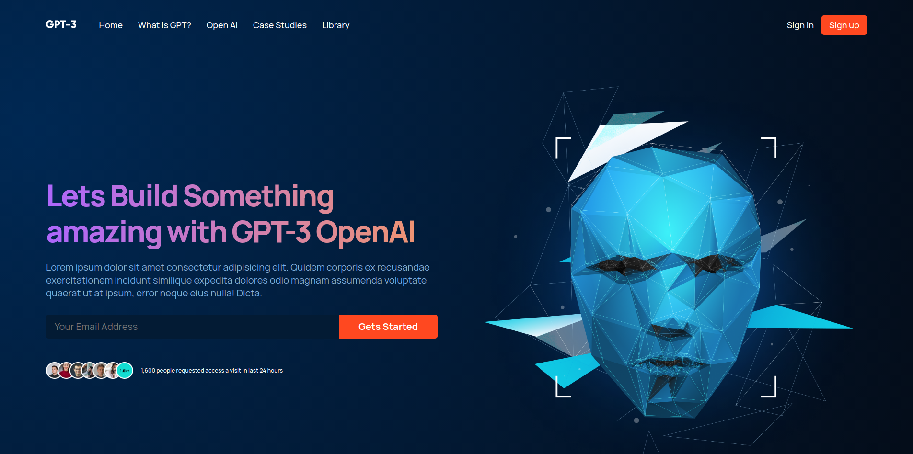

# React Components



> This repository contains a collection of React components for a website. Each component is self-contained and can be used independently or combined to build different pages.

# Components
- NavBar
- Header
- whatGPT3
- Article
- Blog
- Feature
- Footer

## Usage

> To use these components in your React application, follow these steps:
### `Install the required dependencies by running npm install or yarn install.`
### Import the desired components from the `Components` directory, for example:

```
import { Navbar, Footer } from './Components';
```

> Use the imported components in your React components, for example:

```
const App = () => {
  return (
    <div>
      <Navbar />
      {/* Other components */}
      <Footer />
    </div>
  );
};

```
> Customize the component props and styling as needed to fit your application's requirements.